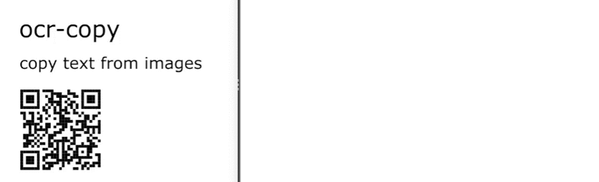

# ocr-copy

## Introduction

Ocr-copy is a tool for easily copying text from your screen. It uses [Tesseract](https://github.com/tesseract-ocr/tesseract) as the OCR engine, [tkinter](https://docs.python.org/3/library/tkinter.html) for graphics, and [pynput](https://pypi.org/project/pynput/) for keyboard monitoring. In addition to reading text this tool can also scan barcodes of all kinds using [pyzbar](https://pypi.org/project/pyzbar/).

## Demo


## Requirements

Tesseract has to be installed manually. Binaries can be found [here](https://tesseract-ocr.github.io/tessdoc/Home.html).

Other requirements can be installed with pip using the following command:
```
pip install -r requirements.txt
```

## Usage

Run settings.py to configure the settings. Then run main.py.

```
python settings.py

python main.py
```

Press alt+s (if using default settings) to start capturing an image. Then click and drag to select the region. Any text or data embedded in a barcode on that region is now on your clipboard.

## Settings

The default settings are:
- Hotkey for capturing image: `<alt>+s`
- Hotkey for killing the program: `<shift>+<esc>`
- Languages: `eng`
- Path to tesseract.exe: `C:/Program Files/Tesseract-OCR/tesseract.exe`

Hotkeys are implemented using pynput. In short:

- Modifiers are surrounded by angle brackets. Example: `<shift>, <alt>, <caps_lock>`
- Other characters are in plain text. Example: `a, b, 1, 2`
- Hotkeys can be combined using the `+` character. Example: `<ctrl>+<shift>+s`

For more details on the hotkeys see the [pynput documentation](https://pynput.readthedocs.io/en/latest/keyboard.html).
